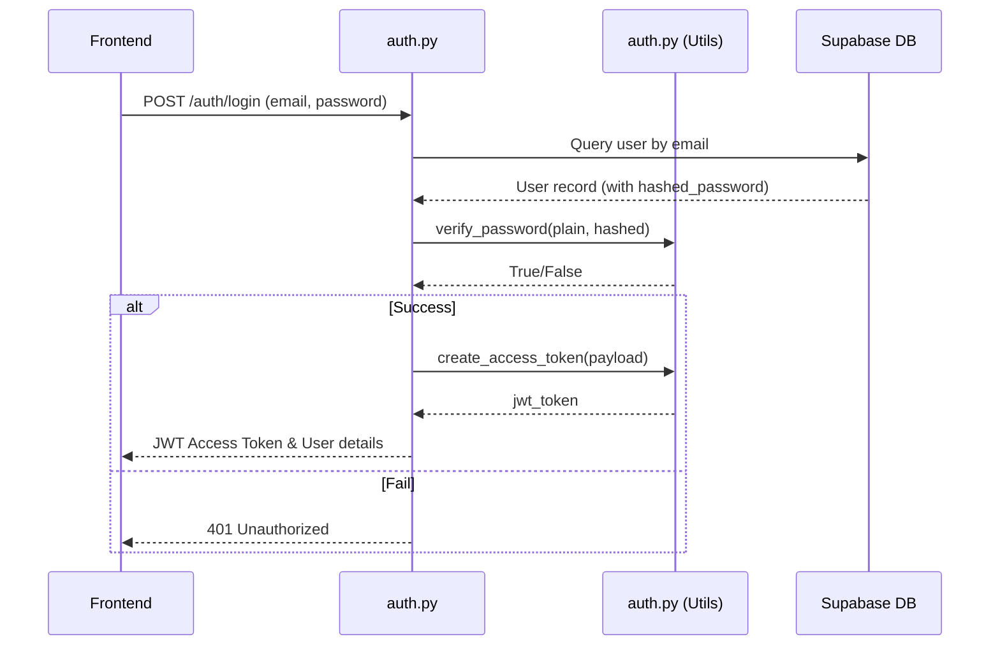
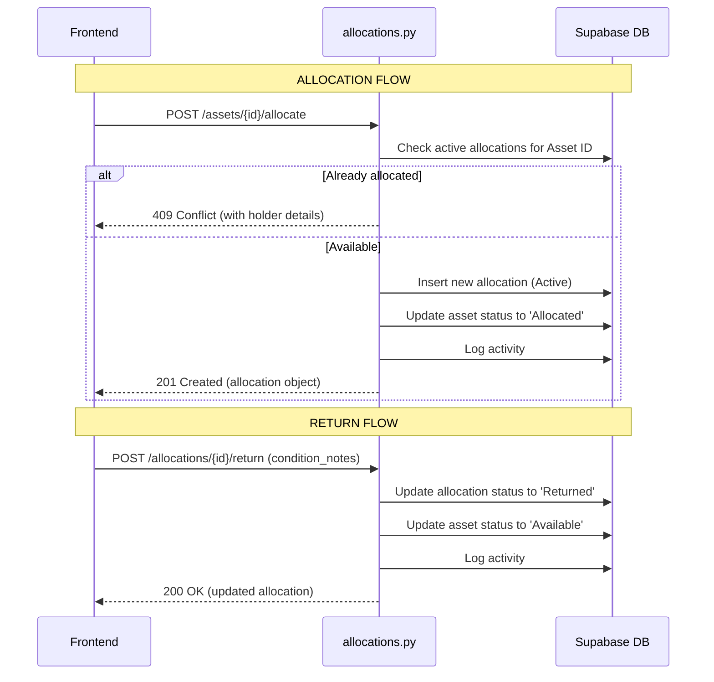

# AssertFlow — Backend Architecture & Design Documentation

This document explains the architecture, directory structure, data flow, and key design decisions of the AssertFlow backend.

---

## 1. Tech Stack & Libraries

The backend is built as a lightweight, high-performance REST API.

*   **FastAPI**: Used as the web framework. It provides automatic interactive documentation (Swagger UI / OpenAPI), validation via Pydantic, and async-first design.
*   **Supabase Python Client (`supabase`)**: Interacts directly with the Supabase Postgres database. Bypasses the need for heavy ORMs (like SQLAlchemy) and leverages Supabase's native API.
*   **Pydantic v2**: Handles data serialization, deserialization, and strict validation.
*   **python-jose**: Handles JWT creation, decoding, and validation.
*   **passlib [bcrypt]**: Hashes and verifies passwords securely using bcrypt.
*   **python-dotenv**: Loads environment variables from the `.env` file during local development.

---

## 2. Directory Structure

```
assertflow/
├── app/
│   ├── main.py              # Application entrypoint & middleware configuration
│   ├── config.py            # Configuration settings and env validation
│   ├── database.py          # Supabase client instantiation & database dependency
│   ├── dependencies.py      # Common FastAPI dependencies (role-based access guards)
│   ├── routers/             # API routes grouped by resource domain
│   │   ├── auth.py          # User signup, login, profile retrieval
│   │   ├── departments.py   # Department management (Admin only)
│   │   ├── asset_categories.py # Category management (Admin only)
│   │   ├── employees.py     # Employee listing and promotions
│   │   ├── assets.py        # Asset registration, details, searching
│   │   ├── allocations.py   # Allocating/returning assets
│   │   ├── transfer_requests.py # User-to-user asset transfers
│   │   ├── bookings.py      # Bookable shared resources
│   │   ├── maintenance.py   # Maintenance workflows & statuses
│   │   ├── dashboard.py     # Dashboard KPI aggregates
│   │   └── activity_log.py  # Audit activity logs
│   ├── schemas/             # Pydantic schemas (Request/Response shapes)
│   │   ├── user.py
│   │   ├── auth.py
│   │   ├── department.py
│   │   ├── asset_category.py
│   │   ├── employee.py
│   │   ├── asset.py
│   │   ├── allocation.py
│   │   ├── transfer_request.py
│   │   ├── booking.py
│   │   ├── maintenance.py
│   │   └── activity_log.py
│   └── utils/
│       ├── auth.py          # Password hashing, JWT creation/validation
│       └── helpers.py       # Sequential asset tag generator, activity logger, booking helper
├── scripts/
│   └── create_admin.py      # Bootstrap script to create the first Admin user
├── .env                     # Local environment variables
├── requirements.txt         # Package dependencies
├── API_DOCS.md              # Frontend Developer Guide
└── README.md                # General readme file
```

---

## 3. Key Design Decisions & Flows

### A. Role-Based Access Control (RBAC)
Role control is implemented using FastAPI's dependency injection (`Depends`). 
*   All endpoints first decode the JWT token using [get_current_user](file:///D:/Odoo/assertflow/app/utils/auth.py#L37-L62).
*   Role checks are handled by wrapper dependencies in [dependencies.py](file:///D:/Odoo/assertflow/app/dependencies.py):
    *   `require_admin` ensures only `Admin` role can proceed.
    *   `require_asset_manager_or_admin` allows `AssetManager` or `Admin`.
    *   `require_asset_manager_or_dept_head` allows `AssetManager`, `DepartmentHead`, or `Admin`.

### B. Dynamic Booking Status (No Database Cron)
Instead of running a background cron job to update booking statuses (e.g., changing status from `Upcoming` to `Ongoing`), the backend computes the booking status **on-the-fly during read operations** in [compute_booking_status](file:///D:/Odoo/assertflow/app/utils/helpers.py#L34-L52):
*   If `status` is manually set to `"Cancelled"`, it remains `"Cancelled"`.
*   Otherwise, it compares the current UTC time to `start_time` and `end_time` to return `Upcoming`, `Ongoing`, or `Completed`.
*   *Why:* This eliminates background worker overhead, avoids distributed locking/database polling, and ensures statuses are always 100% accurate on read.

### C. Booking Overlap Guard
To prevent double-booking of shared resources, the booking creation endpoint in [bookings.py](file:///D:/Odoo/assertflow/app/routers/bookings.py#L42-L54) validates time bounds:
*   An overlap occurs if: `existing.start_time < new.end_time AND existing.end_time > new.start_time`.
*   Boundary contacts are exclusive (e.g., booking 1 ends at 10:00, booking 2 can start at 10:00).

### D. Sequential Asset Tagging
When an asset is registered, the system auto-generates sequential asset tags (e.g. `AF-0001`, `AF-0002`) in [generate_asset_tag](file:///D:/Odoo/assertflow/app/utils/helpers.py#L21-L31). It selects the latest registered asset, extracts its number, increments it by 1, and formats it with zero-padding.

### E. Bootstrap Admin Script
Since standard user registration (`POST /auth/signup`) defaults the role to `Employee` for security reasons, the first Admin user must be bootstrapped. The one-off Python script [create_admin.py](file:///D:/Odoo/assertflow/scripts/create_admin.py) prompts for details, hashes the password using the same scheme, and inserts the user record with the `Admin` role directly into Supabase.

---

## 4. Main Data Flows

### User Authentication Flow


### Asset Allocation & Return Flow

